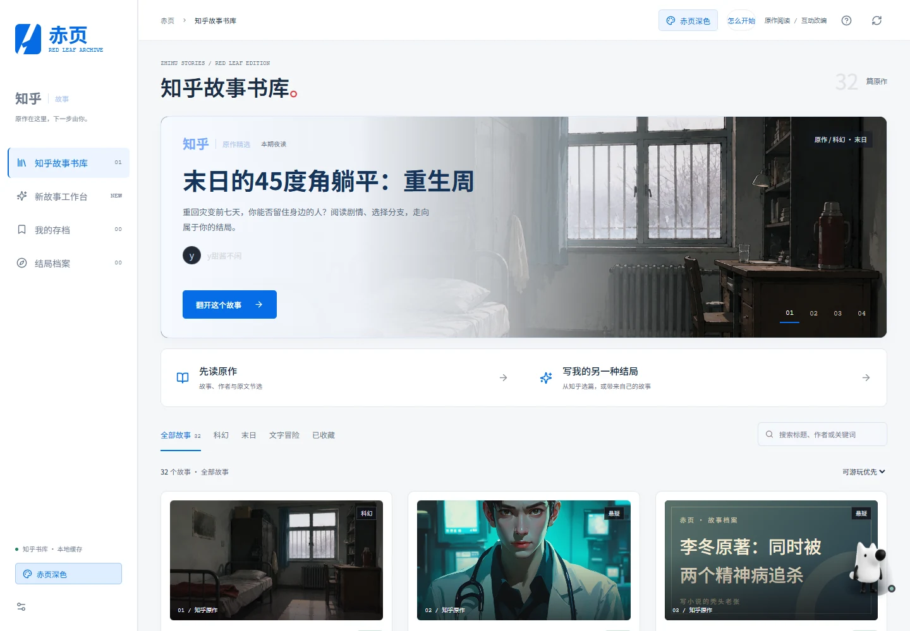
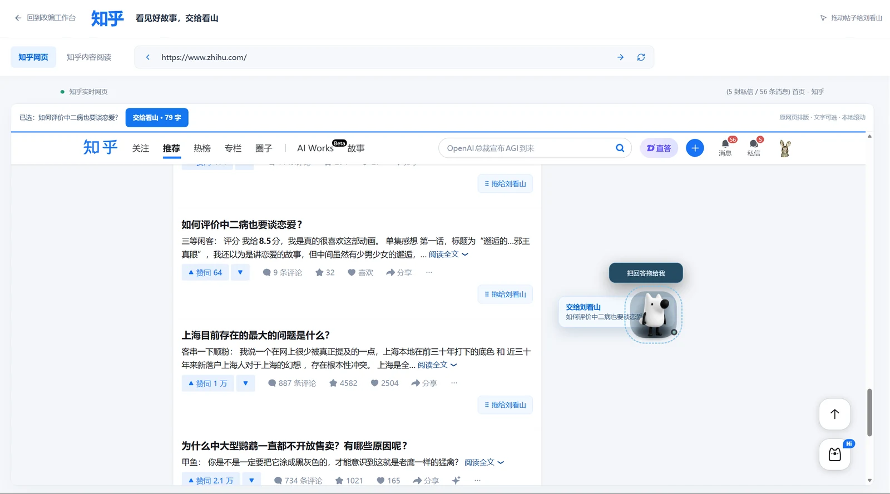
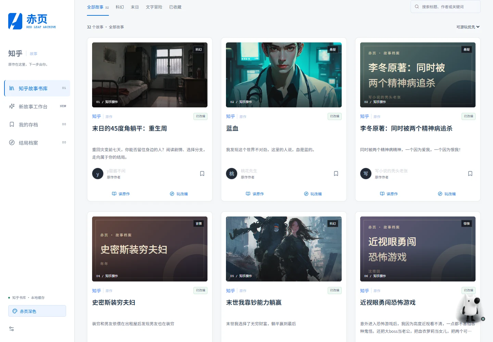
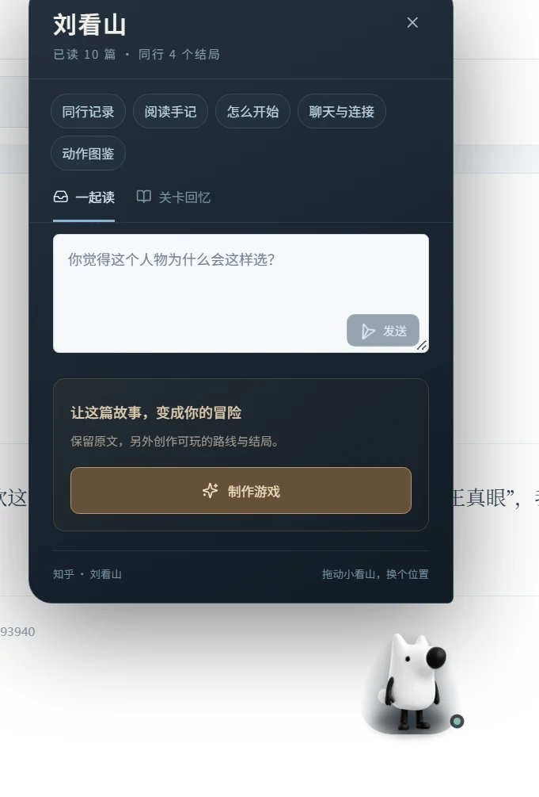
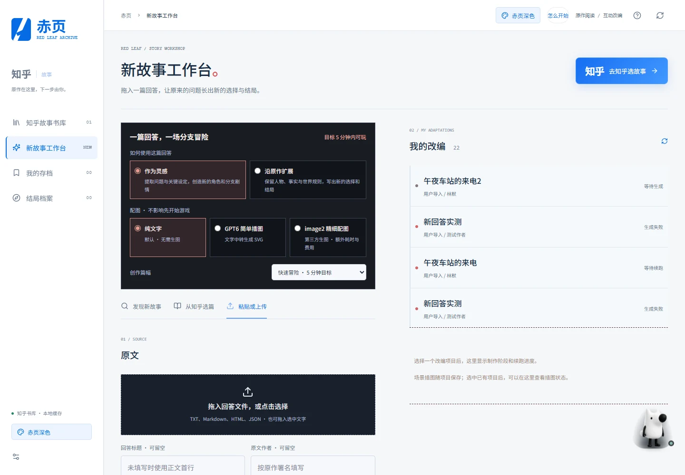
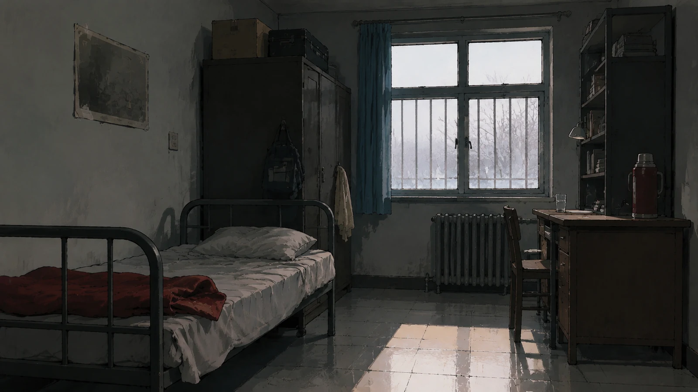
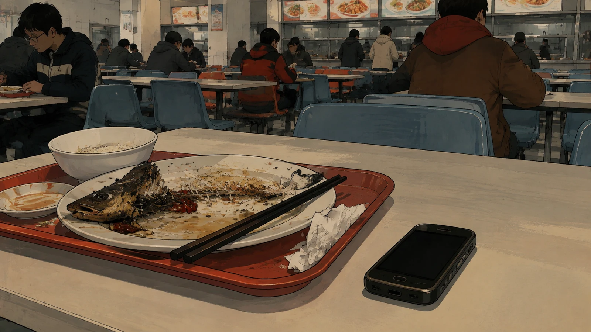
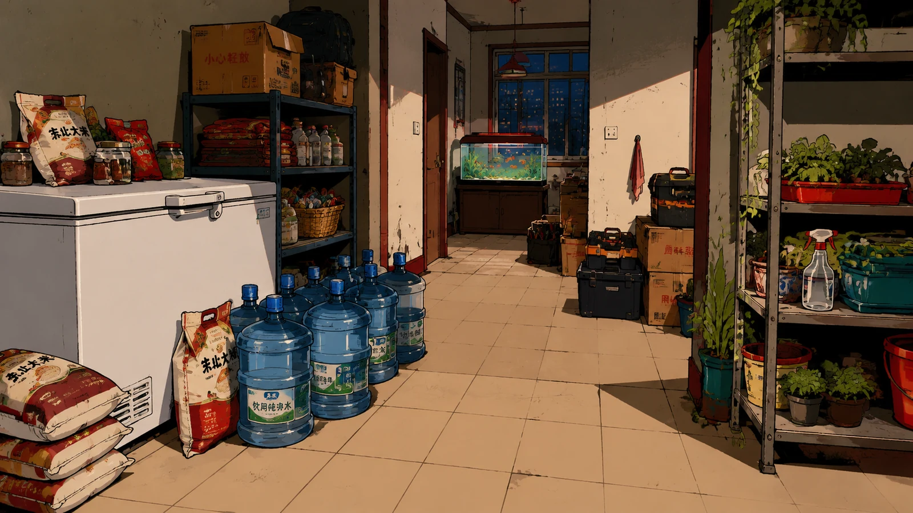
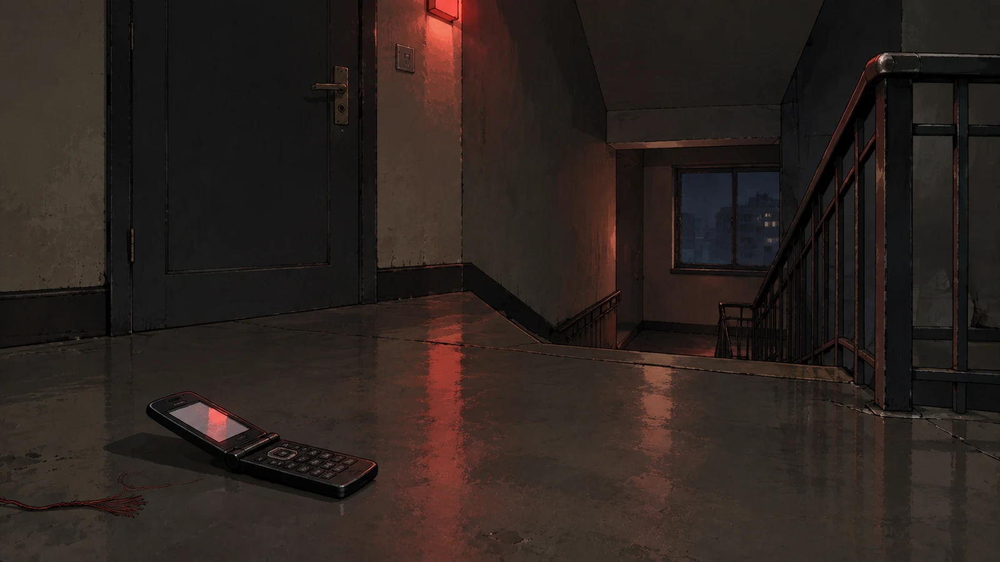
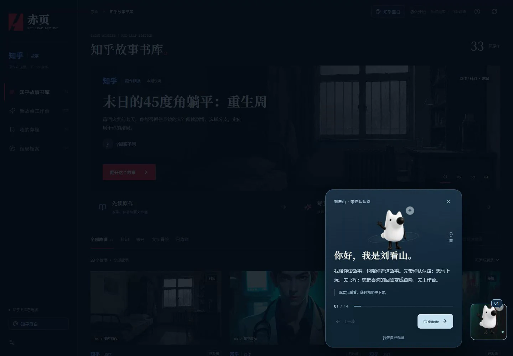

<div align="center">

# 赤页 RED LEAF

### 把知乎回答变成可玩的故事

**从真实回答出发，阅读、理解、改编，再亲自走进故事。**

[产品体验](#从一篇回答开始) · [重生周](#核心作品重生周) · [开始使用](#开始使用) · [完整图文计划书](docs/product-overview.md)

</div>



知乎沉淀了大量经验、观点、故事和问题解决过程。**赤页**让读者多一种参与方式：在保留原作来源的前提下，通过角色、行动、资源、线索和多结局，亲自体验回答中的因果关系。

你可以阅读原作、用刘看山手记梳理线索，也可以将回答改编为互动故事。在故事里，每次调查、求助和选择都会留下结果；保存进度、回溯路线，再试一次自己的判断。

| 阅读真实内容 | 进入可玩的世界 | 继续你的创作 |
| :--- | :--- | :--- |
| 保留标题、作者、原文节选和来源链接 | 调查、推理、分配资源，走向不同结局 | 设计人物、场景、对白、分支与美术 |
| 刘看山整理摘要、人物、时间线与线索 | 自动存档、手动备份、剧情回看与回溯 | 从纯文字到简单插图、精细配图版本 |

## 从一篇回答开始

**选择内容 → 理解原作 → 设计分支 → 进入故事 → 回溯与再创作。**

在知乎来源页选择回答，或从书库进入已收录的作品。原文、作者和来源始终可以回看，游戏对白、分支、结局与视觉表现标明为互动改编。



### 刘看山，陪你读懂故事

摘要、人物关系、时间线、动机、线索和不确定点会整理为阅读手记。读者可以带着原文依据继续阅读，也可以从这些线索出发设计自己的分支。

<table>
  <tr>
    <td width="70%"></td>
    <td width="30%"></td>
  </tr>
</table>

### 把理解写成一个可以行动的世界

在创作工作台中选择改编方向，梳理人物、场景、选择与结局，再编译成可玩的版本。来源与改编内容保持对应，方便复核和继续编辑。




## 核心作品：重生周

### 《末日的45度角躺平：重生周》

**你回到了灾变前七天。这一次，先做什么？**

主角带着记忆重新醒来，却无法一次性证明全部信息。身边的人有各自的判断、恐惧和利益；每次求助、采购、调查或等待，都在消耗有限的准备时间。

作品改编自知乎回答《末日的45度角躺平》，原作作者为 **y甜酱不闲**。[阅读知乎原作](https://www.zhihu.com/question/540354406/answer/2588140006)



### 七天，三种取舍

| 信息 | 资源 | 关系 |
| :--- | :--- | :--- |
| 记忆是否可靠？谁掌握关键事实？ | 先调查、先采购，还是保留行动机会？ | 谁会相信你？你愿意带谁同行？ |
| 收集证据，判断消息真伪 | 分配时间、物资和行动次数 | 求助、建立信任、承担保护他人的代价 |

| 玩法系统 | 玩家做什么 | 选择留下什么 |
| :--- | :--- | :--- |
| **七日倒计时** | 在每个时间窗口决定下一步 | 不同的准备状态与行动成本 |
| **多线选择** | 调查、准备、相信或怀疑人物 | 不同的路线、人物关系和后续事件 |
| **资源管理** | 分配物资、信息与行动机会 | 能否执行救援、转移与高风险行动 |
| **线索拼接** | 从不同场景寻找证据 | 推理方向与隐藏路线 |
| **多结局** | 用现有信息做出最终判断 | 可以比较、复盘和再次挑战的结果 |
| **存档回溯** | 保存、备份、导入导出与重选 | 可持续的游玩记录 |

### 从日常走向变局

<table>
  <tr>
    <td width="50%"><br><strong>校园</strong> · 从熟悉的日常中寻找线索</td>
    <td width="50%"><br><strong>消息</strong> · 判断下一条信息是否值得相信</td>
  </tr>
  <tr>
    <td><br><strong>分流</strong> · 去哪里、跟谁走、相信谁</td>
    <td><br><strong>同行</strong> · 带着自己的选择进入下一阶段</td>
  </tr>
</table>

### 七日倒计时

| Day 1–2：确认与预警 | Day 3–4：调查与准备 | Day 5–7：关系与抉择 |
| :--- | :--- | :--- |
| 确认重生、观察异常，决定是否告知身边人 | 调查关键人物与地点，分配交通、物资与医疗资源 | 联系重要的人，处理最后的准备窗口，进入灾变节点 |



### 你想保护的人，也有自己的判断

角色提供线索、能力与情绪支点，也会带来新的资源需求和关系变化。合作能否成立，取决于此前的行动和信任。

<table>
  <tr>
    <td align="center" width="20%"><br><strong>贾巧莹</strong><br>同行与信任</td>
    <td align="center" width="20%"><br><strong>贾忠</strong><br>家庭与现实</td>
    <td align="center" width="20%"><br><strong>救援队长</strong><br>秩序与路线</td>
    <td align="center" width="20%"><br><strong>阮子阳</strong><br>信息与合作</td>
    <td align="center" width="20%"><br><strong>尹教授</strong><br>专业与风险</td>
  </tr>
</table>

### 把准备变成具体的行动

<table>
  <tr>
    <td align="center" width="25%"><br><strong>物资</strong><br>行动、救援与转移</td>
    <td align="center" width="25%"><br><strong>地图</strong><br>地点、路线与事件</td>
    <td align="center" width="25%"><br><strong>关系</strong><br>信任、同行与求助</td>
    <td align="center" width="25%"><br><strong>研究</strong><br>证据、异常与推理</td>
  </tr>
</table>

车钥匙、医疗包、科技包和围棋等物品进入剧情，成为执行行动或理解线索的依据。

<details>
<summary><strong>展开查看：关键道具与结局美术</strong></summary>

<table>
  <tr>
    <td width="25%"></td>
    <td width="25%"></td>
    <td width="25%"></td>
    <td width="25%"></td>
  </tr>
</table>

结局记录反馈信息、资源与关系的累积结果，帮助玩家回看自己的判断。

<table>
  <tr>
    <td width="50%"></td>
    <td width="50%"></td>
  </tr>
</table>

</details>

## 在故事里选择，在回溯中理解

一次游玩从明确身份、目标和资源开始。玩家阅读场景、观察人物、执行行动，再根据新线索决定相信谁、先做什么、承担什么后果。



行动结果、资源变化与新线索会留在记录中。自动存档保存当前进度；手动备份、导入导出和剧情回看支持继续游玩与路线比较。

首批故事世界包括：

| 作品 | 体验方向 |
| :--- | :--- |
| **末日的45度角躺平：重生周** | 七日倒计时、信息判断、关系与生存准备 |
| **蓝血** | 线索调查与身份判断 |
| **同时被两个精神病追杀** | 关系判断与生存选择 |
| **史密斯装穷夫妇** | 信任、资源与路线选择 |
| **末世我靠钞能力躺赢** | 资源管理与生存决策 |

## 从阅读到共创

| 对读者 | 对创作者 | 对社区 |
| :--- | :--- | :--- |
| 亲自经历一次判断，尝试不同路线 | 将回答扩展为可编辑的互动故事 | 围绕具体选择、线索与结局展开讨论 |
| 在回溯与比较中理解因果 | 复用人物、场景、分支和配图流程 | 积累二次创作与复玩的新入口 |

**回答提供知识与故事，读者提供判断与行动，社区提供讨论与再创作。**

## 技术与资源

| 层级 | 实现 |
| :--- | :--- |
| 前端工作台 | React 19、TypeScript、Vite |
| 分支叙事 | InkJS、故事编译、资源与线索状态、条件和结局 |
| 服务端 | Node.js、Express、内容读取与来源保留、创作与校验接口 |
| 独立游戏 | 《重生周》嵌入式运行时，通过 `postMessage` 同步游戏状态 |
| 进度管理 | 自动存档、手动备份、导入导出、回溯与结局记录 |
| 美术管理 | Git LFS 保存原图、透明人物、场景、道具与游戏资源 |

仓库已发布 **3,608 个公开资源文件，约 8.75 GiB**。首页配图来自产品说明书，提供适合网页阅读的轻量版本；游戏中的原始美术保留在以下目录：

- [生成美术与角色透明图](public/generated-art/)
- [基础美术资源](public/assets/)
- [重生周游戏与资源](public/games/redrain/)
- [逐文件资源校验清单](docs/public-assets-manifest.json)

## 开始使用

需要 **Node.js 22 或更新版本**、Git 和 Git LFS。

```bash
git lfs install
git clone https://github.com/wzn1118/zhihu-story-worlds.git
cd zhihu-story-worlds
git lfs pull
npm ci
npm run dev
```

在浏览器打开启动日志中的本机地址。从故事书库进入作品，点击“原作”查看来源；进入《重生周》后可以继续游玩、保存、导出和回溯。

**完整美术请通过 Git LFS 获取。** 仅下载源码 ZIP 可能得到资源指针文件，不能代替原图。

生产构建与启动：

```bash
npm run build
npm run start
```

<details>
<summary><strong>公网部署、故事 CLI 与开发验证</strong></summary>

公网模式需要固定会话密钥，并配置 HTTPS 反向代理：

```powershell
$env:PUBLIC_MODE="1"
$env:HOST="0.0.0.0"
$env:SESSION_SECRET="随机生成的长字符串"
npm run start -- --production
```

账号数据默认写入 `.local/auth/users.json`。生产环境需要持久化存储；本机账号、浏览器会话、密钥与个人工坊数据不随仓库发布。

故事接口命令行入口：

```bash
node scripts/story-cli.mjs list --genre 科幻 --limit 3
node scripts/story-cli.mjs list --genre 悬疑 --query 蓝血
node scripts/story-cli.mjs get 2025684191967294692
```

接口结果保留来源、作者、获取时间及缓存状态。上游服务不可用时显示真实错误或缓存状态。

```bash
git lfs pull --include="public/assets/liukan/**" --exclude=""
npx playwright install --only-shell chromium
npm test
npm run build
```

GitHub Actions 会在推送和 PR 中运行 Node.js 22 全量测试、TypeScript 检查及生产构建。
测试使用仓库内记录的故事节选和美术设定，无需本机账号、故事缓存或制作输出目录。
CI 仅下载测试实际读取的流看原始素材；生成图仍完整保存在 Git LFS 中。
CI 的构建用于编译验证，不作为包含全部美术的部署包。

发布时的验证记录见 [GitHub 发布说明](docs/github-publication.md)。

</details>

## 继续建设

项目正在补充各故事世界的角色与场景美术，完善来源段落到剧情节点的映射，并优化创作者编辑、审核与发布流程。

后续方向包括作者共创模板、读者分支投稿、作品反馈与结局数据面板，以及职场经验、生活决策、科普解释等更多题材。

- [完整图文产品说明：保留原说明书全部 57 处配图](docs/product-overview.md)
- [故事与剧情引擎契约](content/CONTRACT.md)
- [美术方向](docs/art-direction.md)
- [行动反馈与回溯说明](docs/choice-outcomes-and-rewind.md)
- [开发进展](progress.md)

---

本页根据《产品说明计划书-可直接提交.md》整理。原作标题、作者、链接与原文节选随故事保留；互动对白、分支、结局和视觉表现属于游戏改编，不代表原作者的原文结论。
