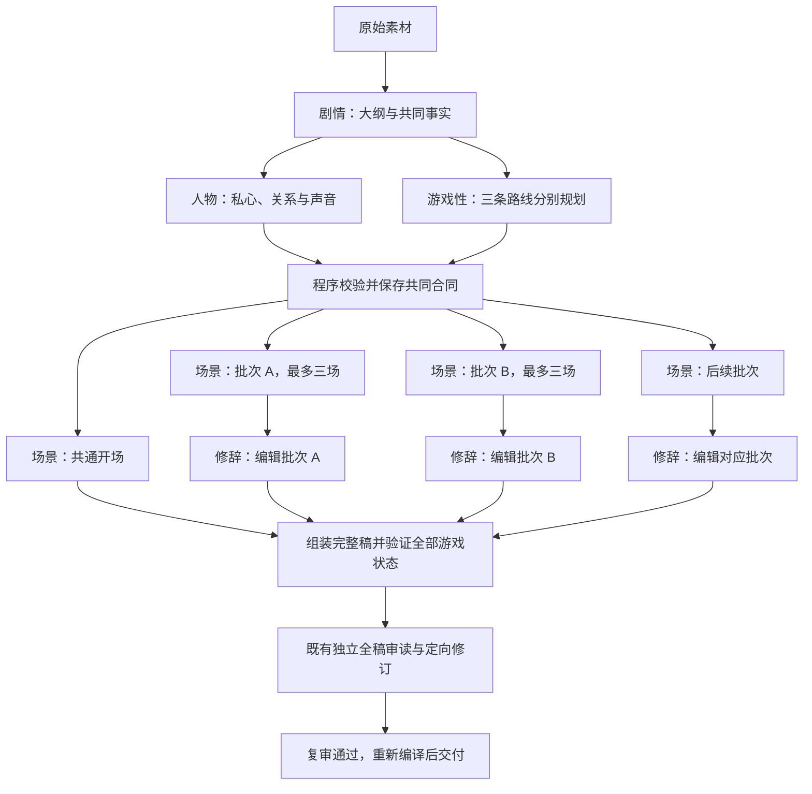

# 完整模式多 Agent 生成

状态：2026-09-14 已部署至 `full-multi-agent-20260914`，新完整模式版本默认启用。161 项相关测试、生产 TypeScript 检查及公网健康/资源/OAuth 检查通过。真实模型样本因上游连续断流未完成整稿，不代表速度或成稿质量已经通过对照验收。实测发现旧 240 秒剧情上限截断了仍在输出的合同，已压缩前置文本并调整单阶段上限。另一次真实样本被资源一致性检查挡住：断电路线只有电量资源；已加强剧情规划的各路线资源前提。并发收益仍需包含失败样本的端到端测量。

## 启用范围

选择完整模式后，配置了 relay 的全新生成版本默认采用 `full-multi-agent-v1`。流程按剧情、人物、游戏性、场景、修辞五种职责组织，全部使用同一次 worker 启动时读取的 relay 配置，推理强度设为 `low`。这里的 Agent 是受约束的模型任务，不运行工具或独立子进程；五种职责会产生多次请求。

已有 `outline.json`、路线稿、旧创作检查点、完整稿或编辑修订来源的版本保留原有流程。通过“重新生成”创建的空白版本可以进入新流程；从已发布版本创建的“编辑修订”保留完成稿。已有 `multi-agent.json` 标记的版本续跑时坚持原策略，即使管理员后来关闭新流程，也不会中途切换到旧生成器。这样的版本缺少 relay 配置时会明确失败并保留进度。

快速模式继续原有一次整稿生成，不调用这一套 Agent。未配置 relay 的新完整模式版本继续原有 CLI 流程。

## 执行顺序与并发



剧情完成后，人物任务与三条路线的游戏性任务进入同一队列；并发上限为 3，因此四项不会同时全部执行。人物与全部游戏性结果通过校验后，锁定共同输入，再启动开场和场景写作。

场景按最多三场一批划分。三个工作循环分别执行“写本批 → 编辑本批 → 领取下一批”，使先完成批次的修辞能与其他批次的场景写作重叠。开场也共享这三个请求名额。一条路线全部批次完成后保存路线稿；只有开场和三条路线齐备才形成完整稿。

每条路线初稿有 10 至 12 个决策、2 至 3 个结局，共 12 至 15 场。正常生成阶段约有 30 至 36 次请求，包括一个剧情任务、一个人物任务、三个游戏性任务、一个开场任务及各批写作/修辞任务；独立审校和必要修复另计。更多调用不等于更快，减少正文串行等待的收益需要实测。

## 职责和写权限

| 角色 | 产物 | 程序限制与语言要求 |
| --- | --- | --- |
| 剧情 | `AgentPlot`：`outline` 与 `canon` | 引文必须逐字存在于原始素材；角色和资源 ID 唯一；登记玩家及人物人数；每个好结局都有具体解谜证据。 |
| 人物 | 每个既定角色的 `desire`、`relationship`、`voice`、`taboo` | 精确覆盖大纲角色 ID，不增删身份。人物笔记实际进入场景、开场和修辞输入；内容须遵守原有动机与共同事实。 |
| 游戏性 | 每条路线的 `graph` 与逐场 `SceneContract` | 使用大纲确定的场景目录、入口和结局身份；声明在场角色、正文前提、场景变化；明确按钮行动、去向、资源消耗、所得线索和门槛。 |
| 场景 | 分配批次的正文、画面描述、提示、即时反馈、结局说明 | `assertSceneGroup` 对照固定图，禁止改动场景身份、地点/时间/说话人/目的、选项动作和所有游戏字段。只补 `text`、`artBrief`、`hint`、`feedback`、`ending.resolution`。共通开场只返回 `text`。 |
| 修辞 | `StylePatchSet` 小补丁 | 只改 `text[index]`、`choices[choiceId].hint/feedback`、`ending.resolution`，不改按钮 `choice.text`、画面描述或图字段。每批最多 12 条，允许零条；优先改最影响阅读的少数位置。 |

修辞提示要求删重复解释、心理总结和套路比喻，保持已有事实、动作、引文、数字、指代和因果。程序能限制字段和原稿身份，不能仅凭哈希证明一句改写保留了全部语义；自然语言问题仍交给独立审读。

这些固定写权限适用于初稿分工阶段。后续既有结构修复与独立编辑可以按验证反馈修订相应内容，保留其自身的身份约束与检查点；修订后重新检查整稿，不能沿用初稿的编译结果作为通过依据。

## 共同事实与状态检查

`canon` 保存人物/匿名群体清单 `cast`、共同规则 `rules`、作者知道的谜底 `truth` 和结局揭示证据 `reveals`。命名大纲角色必须按原 ID、原姓名登记且人数为 1；玩家也必须且只计 1 人。匿名群体可单列人数。`SceneContract` 包含场景 ID、身体在场的 `castIds`、默认成立的 `requires` 与本场发生的 `change`。

游戏性输出先通过与播放器一致的资源及线索状态计算，再交给场景作者。检查包括：

- 全部节点与每个选项至少能在一个实际状态下到达；无循环、无跨路线去向，主要路径至少七次决策。
- 每个决策有至少两个不同去向，并有不要求线索、不消耗资源的出口。
- 至少三场包含资源取舍、两场包含线索门槛；成本资源不重复且已定义。
- 支持已有线索、`!线索` 与资源比较条件，禁止靠本次选择新获得的线索满足自己的门槛。
- 场景 `requires` 必须在每个实际入口状态成立。写作者收到共有线索、确定未获得的线索、资源范围及每条真实入边，避免把别的支路经历当作共同记忆。

每条路线的状态枚举上限为 150,000；最终编译器再次检查整部游戏，也有总状态预算。

当前状态系统仍是单调增加的线索和数值资源。人物移动、生死、伤势、物品持有人、承诺撤回以及 NPC 知识尚无完整的独立状态机；人物表的唯一性也不能证明自然语言不存在群体重复计数。游戏性提示要求把影响共同正文的分支事实分开或在反馈里交代，编辑审读负责继续查因果和人数。不能把当前实现描述成自动证明人物状态守恒或完全消除幻觉。

## 时限与共享限额

完整模式的本轮 Runner 默认总预算是 **30 分钟**，由 `WORKSHOP_FULL_AGENT_BUDGET_MS` 设置，允许 60,000 至 2,700,000 毫秒。截止时间从本轮 worker 创建 Runner 时计算；续跑开始新的轮次预算。排队、生成、修辞、Runner 接管的结构修复及独立审校共享同一截止时间，超时会停止在途请求及后续排队任务。

此前的 285 秒项目时限只属于快速模式，不能用来宣称完整模式五分钟完成。总时限是失败边界，不是预计等待时间。

| 任务 | 单次请求上限 | 输出 token 上限 |
| --- | ---: | ---: |
| 剧情 | 360 秒 | 8,500 |
| 人物 | 120 秒 | 2,000 |
| 每条路线游戏性 | 300 秒 | 7,000 |
| 共通开场 | 120 秒 | 1,600 |
| 每批场景 | 180 秒 | 5,000 |
| 每批修辞 | 60 秒 | 2,000 |
| 单场结构修复 | 180 秒 | 5,000 |
| 整稿验证修复、独立审校任务 | 240 秒 | 14,000 |

实际请求上限取上述值与本轮剩余时间的较小值。token 上限由 relay 请求传递；它不保证模型一定能在上限内完成结构化输出。

并发控制有两层：每个 Runner 最多三个在途任务；使用同一租约根目录、相同 relay endpoint 与 API key 的多个 worker 合计最多三个请求。租约保存进程身份，确认持有者已死亡后才回收，不靠短 TTL 抢占慢请求。这里的共享限额只覆盖经过新 Runner 的请求；旧完整流程、快速模式、外部客户端以及不同租约存储上的实例不会自动计入。

## 失败、检查点与续跑

每项任务的缓存绑定角色、任务键、提示、schema、固定 relay 配置与输出上限；其中提示包含实际来源及上游输入。成功原稿、内容哈希与接受记录对应保存。只拿到原稿、尚未写接受记录时，续跑会重新验证并恢复；损坏或哈希不符的记录不会被静默复用。同一轮次已登记但没有完整结果的请求不自动重复发送，新轮次才可带着原稿与校验反馈重试。

必要场景失败后停止领取后续批次，已在运行的同伴任务仍可保存成功结果。人物或游戏性阶段则等待已提交任务结算后汇报失败。缺少剧情、游戏性、开场或场景时不能用模板填补并发布。

修辞是可选编辑：单次修辞超时、无效补丁或其他失败会保留该批场景 Agent 的原稿，报告记为 `skipped`；零条合法补丁记为 `unchanged`，成功修改记为 `applied`。整个任务取消或总预算耗尽必须停止，不能按可选修辞失败提交完整稿。无论有无修辞补丁，独立全稿审读都必须完成；有阻断问题、审校超时或最终编译失败仍不能发布。

完整稿形成后，`agent-current-draft.json` 用一个原子快照绑定来源哈希、稿件哈希和完整内容，`draft.json` 是兼容镜像。续跑优先读取最新有效快照，保留后续已保存的验证/编辑修订；不会重新组装初稿覆盖它。经工作进程确认并应用的恢复稿可更新快照，并记录已消费的恢复标识，避免旧恢复记录反复覆盖新修订。独立编辑内部尚未返回的中间修订，继续由其自身的逐轮检查点恢复。

`agent-generation-report.json` 的 `draftHash` 描述分工阶段初稿，不等于编辑修订后的最终稿哈希。最新完整稿以原子快照为准，最终通过依据是 `editorial-report.json` 与当前稿匹配且编译通过。

## 配置、回滚与记录位置

管理员在服务进程环境中配置，重启服务后供新 worker 继承：

```dotenv
# 未设置或不为 0 时，对符合条件的新完整版本启用。
WORKSHOP_FULL_MULTI_AGENT=1

# 本轮总预算，默认 1800000 毫秒。
WORKSHOP_FULL_AGENT_BUDGET_MS=1800000
```

回滚新版本默认策略时设置 `WORKSHOP_FULL_MULTI_AGENT=0`。它不改变正在运行或已有分工标记的版本；需要旧流程的新稿时，在关闭后创建新的生成版本。不要删除当前版本标记或混合两套检查点。relay 配置仍使用工作台现有配置入口与 `configuredRelay()` 读取机制。

记录都在现有工作台数据根目录内。默认根目录是 `/data/zhihu-project/.local/story-workshop`；部署若另传 root，以实际值为准。

| 相对于工作台 root 的位置 | 用途 |
| --- | --- |
| `projects/<id>/source.json` | 独立保存的原始素材，生成过程不改写。 |
| `projects/<id>/project.json` | 项目进度、阶段事件与最近错误。 |
| `projects/<id>/r<n>/multi-agent.json` | 本版本策略及来源绑定。 |
| `projects/<id>/r<n>/agent-contract.json` | 剧情、人物、三条游戏性规划及合同哈希。 |
| `projects/<id>/r<n>/agents/<role>-<keyHash>/<inputHash>/` | 请求登记、原稿、接受/拒绝/失败记录；原稿含耗时和上游返回的数值 token 用量。 |
| `projects/<id>/r<n>/agent-generation-report.json` | 分工初稿信息、路线场数、各批修辞状态。 |
| `projects/<id>/r<n>/agent-current-draft.json` | 最新完整稿原子快照及来源/内容校验和。 |
| `projects/<id>/r<n>/editorial/` | 既有独立审校的逐轮输入、快照与修订记录。 |
| `projects/<id>/r<n>/editorial-report.json`、`validation.json`、`world.json` | 最终审校结果、结构验证和可玩产物。 |
| `agent-leases/scope-<hash>/` | 同 relay/key 的跨进程请求租约。 |

Runner 记录的是 relay 配置哈希，不把 API key 写入任务记录；失败消息会过滤配置里的 endpoint/key。原稿和合同仍包含用户素材，沿用项目私有数据目录管理。

## 验证与后续验收

实现测试覆盖并发重叠、跨进程限额、排队时限、取消、同轮避免重复请求、原稿恢复、失败同伴保留、完整稿快照恢复、角色越权、修辞白名单和分支状态共有条件。相关测试文件是 `workshop-agent-runner`、`workshop-agent-contract`、`workshop-agent-patches` 与 `workshop-multi-agent`。这些使用受控输入，不能代替真实模型成稿验收。

真实验收需固定来源、模型、推理强度、传输方式、篇幅和提供方条件，对比旧完整模式与新完整模式。记录包括排队和独立编辑在内的端到端 P50/P95、成功率、超时率、重试和 token 用量；失败不能从样本中剔除。对不同题材盲评人物目的、对白自然度、选择后果、状态一致性与谜底兑现。在取得这些结果之前，不承诺保持原耗时、稳定提速或消除 AI 味。

主要实现：[调度](/data/zhihu-project/server/workshop-multi-agent.ts)、[Runner](/data/zhihu-project/server/workshop-agent-runner.ts)、[共同事实与状态](/data/zhihu-project/server/workshop-agent-contract.ts)、[提示词](/data/zhihu-project/server/workshop-agent-prompts.ts)、[修辞补丁](/data/zhihu-project/server/workshop-agent-patches.ts)、[完整稿快照](/data/zhihu-project/server/workshop-agent-draft.ts)、[worker 接入](/data/zhihu-project/server/workshop-worker.ts)。

## 本次验证记录

生产发布清单见 `output/full-multi-agent/deployment.json`，161 项测试结果见 `final-tests.log`。真实独立 worker 通过本地 HTTP 模拟提供方走完五角色、独立审读和最终发布（31 次请求、37 节点、64 可达状态）；这是集成验证，不是模型成稿评分。

真实 relay 验证输出在 `output/full-multi-agent/live-sample`。前两次剧情请求受旧 240 秒上限阻断；第三次剧情/人物和两条图通过，另一条被资源约束拒绝。调整规划后，第四次三条图与多数正文通过，录音路线一批正文遭遇连接中断；第五次续跑恢复已完成任务并补成该批，但弃站路线的上游响应失败。没有以测试稿或模板替补真实输出。续跑次数与失败均保留在记录中。

第六次续跑又补成弃站路线一批，但同路线另一批仍遇到上游失败。当前验证进程已停止，保存的成功检查点可继续恢复；未生成最终整稿和独立审校通过记录，也未将隔离验证样本发布成用户游戏。本次真实试跑不能支持提速或质量增益的统计结论。
