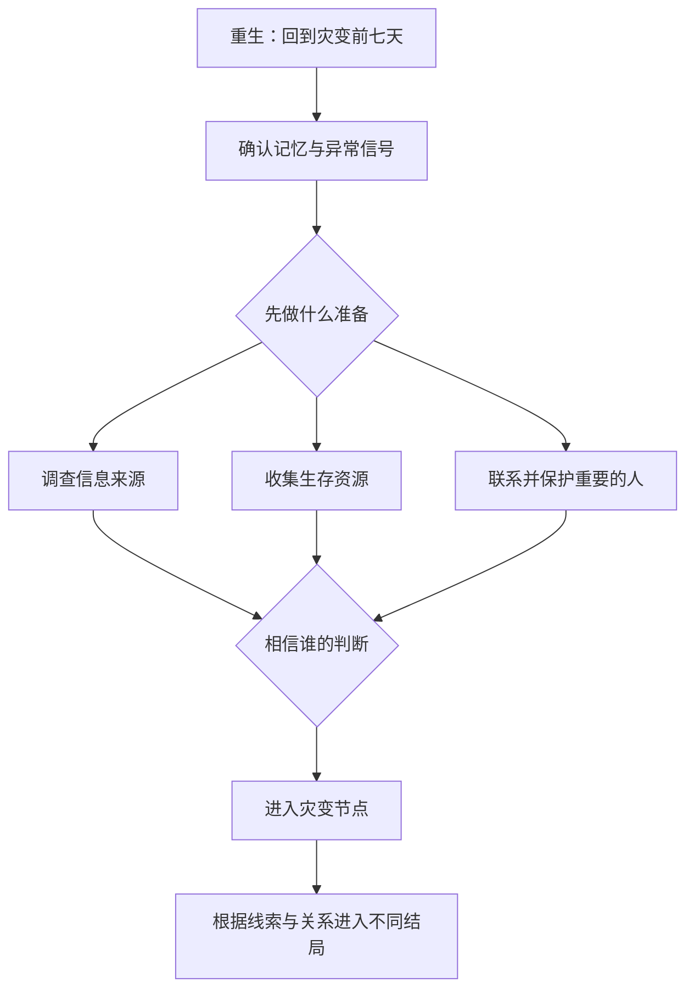
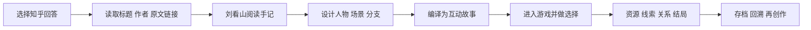
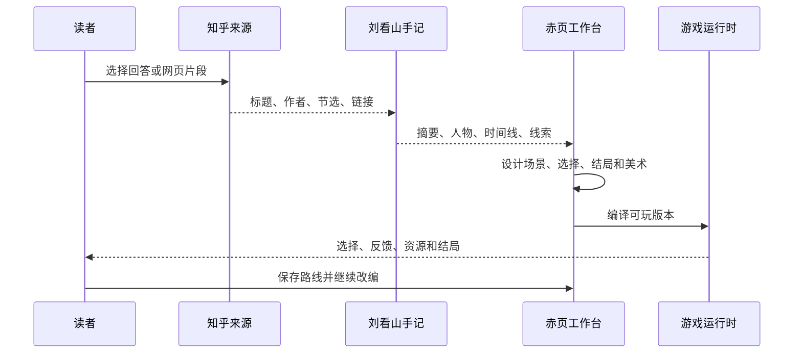

# 赤页 RED LEAF：把知乎回答变成可玩的故事

> **项目类型：** 知乎内容驱动的互动叙事与创作工具  
> **项目定位：** 从真实知乎回答出发，完成阅读、理解、改编、生成和游玩的完整闭环。  
> **当前形态：** 已有可运行工作台、真实来源接入、4 个可玩故事世界、移动端适配和图文创作流程。


## 核心作品：《末日的45度角躺平：重生周》

《重生周》是本项目的重量级示范作品，也是验证“知乎内容如何变成真正游戏”的主线样板。作品改编自知乎回答《末日的45度角躺平》，原作作者为 **y甜酱不闲**，来源链接为：[知乎原作](https://www.zhihu.com/question/540354406/answer/2588140006)。

故事设定是：主角重回灾变前七天，必须在有限时间里重新认识环境、判断信息真伪、准备生存资源，并决定是否把重要的人带进下一阶段。玩家不是被动阅读结局，而是在每一个时间窗口内做出会改变后续状态的选择。


### 作品的核心玩法

| 玩法系统 | 在《重生周》中的表现 | 对知乎内容的转译 |
| --- | --- | --- |
| 七日倒计时 | 每个阶段都有明确的时间压力 | 把原作中的危机节奏变成可感知的行动成本 |
| 多线选择 | 调查、准备、相信或怀疑不同人物 | 把阅读中的观点分歧变成玩家自己的判断 |
| 资源管理 | 物资、信息、关系和行动机会有限 | 让“如果当时这样做”变成真实后果 |
| 线索拼接 | 不同场景获得不同证据，影响推理方向 | 让读者回到细节，理解故事中的因果链 |
| 多结局 | 根据路线和关键状态进入不同结局 | 鼓励复玩、比较和社区讨论 |
| 存档回溯 | 自动存档、手动备份、导入导出和路线回看 | 让一次阅读变成可持续的体验记录 |

### 重生周的叙事结构



### 为什么它适合知乎

《重生周》同时具备知乎用户熟悉的三类内容特征：真实问题引发的讨论、强情境的故事阅读，以及“如果是我会怎么做”的经验判断。赤页将这三类内容合并为一个可玩的循环：

1. **先读原作，建立共同语境。** 玩家可以随时打开原文节选、作者信息和来源链接。
2. **再做判断，承担选择后果。** 游戏把生存准备、信任关系和信息真假变成状态变量。
3. **最后比较路线，回到社区讨论。** 不同玩家会走出不同结局，适合形成“你的重生周怎么过”的讨论与二次创作。


## 《重生周》完整作品拆解

### 世界观与核心冲突

《重生周》的核心不是“知道末日会来”这么简单，而是把预知变成一组互相牵制的责任：主角知道灾变即将发生，却无法一次性证明全部信息；身边的人有各自的判断、恐惧和利益；有限的七天里，任何一次求助、采购、调查或等待，都会挤占另一项准备的时间。

玩家因此面对三层冲突：

- **信息冲突：** 记忆是否可靠，谁掌握了关键事实？
- **资源冲突：** 时间、物资、行动次数和信任无法同时最大化。
- **关系冲突：** 想保护的人未必相信你，过度干预也可能改变关系结果。

### 序章五个关键镜头

#### 01｜重生：重新获得七天


玩家首先确认自己的新起点：记忆带回来了，但世界还没有进入公开的灾变状态。此处建立“时间有限、信息不完整、必须主动行动”的基本规则。

#### 02｜预警：红雨成为第一个公共信号


红雨不是纯粹的背景特效，而是推动玩家从个人记忆进入公共危机的证据。玩家需要决定是立即相信异常、继续观察，还是优先准备身边的人。

#### 03｜证明：把“我知道未来”变成可验证线索


这一阶段把叙事重点从预言转向证据。玩家要收集能够说服他人的信息，判断哪些线索值得投入行动机会，哪些信息仍然只能保留为个人判断。

#### 04｜分流：机场与多方信息同时到来


机场段落把“去哪里、跟谁走、相信哪条消息”变成同时发生的路线选择。不同选择会改变后续可抵达地点、可获得人物和可使用资源。

#### 05｜安全屋：准备的结果必须承担


安全屋是序章阶段性收束点。玩家在这里看到此前采购、调查和关系选择的累计结果，并进入下一轮更高风险的生存决策。

### 七日倒计时

| 天数 | 主要叙事任务 | 玩家核心问题 | 可能后果 |
| --- | --- | --- | --- |
| Day 1 | 确认重生与异常记忆 | 先验证还是先准备 | 错过早期证据或节省行动次数 |
| Day 2 | 观察公共信号 | 是否公开告知身边人 | 信任增加，也可能被视为不可信 |
| Day 3 | 调查关键人物与地点 | 哪条消息值得相信 | 解锁不同线索链和人物路线 |
| Day 4 | 采购与资源分配 | 物资、交通、医疗先保什么 | 后续行动能力和安全上限变化 |
| Day 5 | 联系重要关系 | 保护谁、放弃什么 | 关系值与可同行角色变化 |
| Day 6 | 处理灾变前的最后窗口 | 是否改变原本事件 | 进入不同准备状态 |
| Day 7 | 灾变节点 | 用现有信息做最终判断 | 触发主线、隐藏线或失败结局 |


### 角色与关系网络

| 角色 | 叙事功能 | 玩家需要判断的关系问题 |
| --- | --- | --- |
| 贾巧莹 | 重要同行者与情绪支点 | 她是否相信主角，是否愿意共同承担风险 |
| 贾忠 | 家庭关系与现实阻力 | 如何解释异常信息，何时请求帮助 |
| 救援队长 | 灾变后的秩序入口 | 是否接受其路线和资源分配 |
| 阮子阳 | 信息与行动能力来源 | 合作是互相保护还是交换条件 |
| 尹教授 | 专业解释与高风险线索 | 专业判断是否值得牺牲当前安全 |


### 资源、地图、关系与研究四个面板

《重生周》的界面系统把抽象的“末日准备”拆成四个玩家可理解的面板：

| 面板 | 玩家看到什么 | 对剧情的实际影响 |
| --- | --- | --- |
| 物资 | 车钥匙、医疗包、科技包等道具 | 决定能否执行行动、救援和转移 |
| 地图 | 机场、教室、实验室、避难所等地点 | 决定移动成本和可触发事件 |
| 关系 | 角色信任、同行和求助状态 | 决定谁会响应玩家的选择 |
| 研究 | 证据、异常信号与未确认信息 | 决定推理路线和隐藏结局 |


### 关键抉择示例

**示例一：是否立刻公开灾变信息**  
公开可以提高部分角色的准备程度，但如果证据不足，会降低信任；保持沉默可以保留行动自由，却可能错过共同准备的窗口。

**示例二：先采购还是先调查**  
先采购能提高短期生存上限，但会放弃一次调查机会；先调查可能发现更高价值的资源地点，也可能因为延误导致物资无法获得。

**示例三：是否带某个角色进入安全屋**  
同行角色会提供能力和情报，也会消耗物资并改变安全屋内部关系。玩家必须判断“保护更多人”与“维持安全上限”之间的取舍。

### 结局与复玩

《重生周》的结局不是单一对错判断，而是对玩家信息、资源和关系管理的综合反馈。坏结局也会保留触发原因，帮助玩家复盘哪一项判断导致了后果。


## 一、项目概述

知乎沉淀了大量经验、观点、故事和问题解决过程，但用户阅读完一篇回答后，通常只能点赞、收藏或离开。**赤页**希望增加一种新的内容消费方式：让读者从旁观者变成参与者，在保留原文来源的前提下，通过角色、行动、资源、线索和多结局，亲自体验回答中的因果关系。

项目不替代知乎原文，也不把改编内容伪装成作者观点。每个故事均保留：

- 原作标题、作者和来源链接
- 可追溯的原文节选
- 改编与原作的明确边界
- 游戏过程中的线索、选择和结局记录

## 项目价值一句话

> **赤页把知乎的“高质量回答”转译成可以阅读、可以判断、可以复玩、可以继续创作的互动故事，并让每一步改编都能回到原作依据。**

## 项目目标与用户画像

| 用户 | 现有痛点 | 赤页提供的价值 |
| --- | --- | --- |
| 知乎读者 | 阅读完成后缺少继续参与的方式 | 通过选择、推理和多结局继续进入内容 |
| 故事作者 | 有内容但缺少互动表达工具 | 从回答直接生成可编辑的故事骨架 |
| 知识型创作者 | 经验容易被快速浏览，难形成理解 | 用模拟决策呈现方法、因果和风险 |
| 社区运营者 | 优质内容的二次传播形式有限 | 形成路线挑战、结局比较和话题讨论 |

## 核心指标设计

项目后续将围绕“内容是否被真正体验”建立指标，而不只统计页面访问量：

- **来源打开率：** 用户是否查看原文和来源说明。
- **首个关键选择完成率：** 用户是否从阅读进入互动。
- **完整路线完成率：** 用户是否走到一个真实结局。
- **多结局复玩率：** 用户是否主动尝试第二条路线。
- **共创转化率：** 用户是否从读者进入改编工作台。
- **讨论触发率：** 用户是否分享选择、线索或结局。

## 二、创作思路

### 1. 从“阅读”转向“参与”

赤页把回答中的关键冲突转译为可行动的情境。读者不只是看到“发生了什么”，还要决定“下一步做什么”，并承担资源变化、关系变化和信息不完整带来的后果。

### 2. 从“单篇内容”转向“可继续的世界”

每篇回答可以成为一个小型故事世界：有明确身份、目标、地点、人物、线索、行动资源和结局。读者可以回溯选择、保存进度、收集不同结局，也可以继续写出自己的分支。

### 3. 从“灵感创作”转向“有来源的创作”

刘看山陪伴面板把摘要、人物关系、时间线、动机、线索和不确定点整理成阅读手记，帮助用户在事实依据上进行二次创作，降低从读者到创作者的门槛。


## 内容改编原则

### 保留什么

- 原作的核心问题、人物关系和情绪张力。
- 可以被验证的事实、观点和关键情节。
- 作者身份、标题、来源链接和原文节选。

### 新增什么

- 玩家身份、行动目标和有限资源。
- 可观察但不完整的信息。
- 会产生后果的选择节点。
- 可比较的路线、结局和回溯记录。

### 明确不混淆什么

游戏对白、分支、结局和视觉表现均标注为互动改编，不代表知乎作者的原文结论，也不替代原作完整内容。


## 三、产品流程



### 用户可以完成的操作

1. 在知乎来源页选择回答，或从故事书库进入已收录作品。
2. 查看原作节选、作者和来源链接。
3. 使用刘看山阅读手记梳理摘要、人物、时间线和线索。
4. 选择“灵感改编”或“沿原作扩展”，设计剧情路线。
5. 生成纯文字、简单插图或精细配图版本。
6. 在故事中调查、推理、分配资源并做出关键选择。
7. 查看行动结果，保存进度，回溯选择并解锁其他结局。


### 创作者工作流



### 一次游玩的典型节奏

1. **建立处境：** 先知道自己是谁、拥有多少资源、要解决什么问题。
2. **阅读与观察：** 获得原作节选、场景信息和人物反应。
3. **行动与消耗：** 调查、移动、求助或准备资源，每次行动都有成本。
4. **判断与分岔：** 根据已有线索决定相信谁、先做什么、牺牲什么。
5. **反馈与复盘：** 看到选择结果，记录新线索，决定继续或回溯。
6. **结局与分享：** 完成一条路线，比较其他结局并回到社区讨论。


## 四、技术方案

### 1. 内容来源层

- 对接知乎故事内容接口和网页选取流程。
- 保存标题、作者、原文链接、获取时间和缓存状态。
- 上游不可用时明确显示缓存或错误状态，不用虚构内容代替真实来源。

### 2. 理解与创作层

- 将回答拆分为摘要、人物、时间线、动机、线索和世界规则。
- 支持改编方案、对白、选择、结局和故事板。
- 每个改编节点保留来源映射，方便复核和继续编辑。

### 3. 游戏运行层

- 使用 React + TypeScript 构建前端工作台和阅读界面。
- 使用 InkJS 管理分支剧情、条件判断和结局路径。
- 使用资源状态、线索、关系、行动点等变量驱动后续剧情。
- 支持自动存档、手动存档、导入导出、剧情回看和回溯选择。

### 4. 发布与验证层

- 前后端分层，服务端负责来源读取、故事编译、校验和存档接口。
- 支持桌面端、窄屏手机和横屏手机。
- 对故事版本、损坏存档、来源失败和图片加载失败进行状态处理。


### 数据与状态模型

```text
Source
 ├─ title / author / originalUrl
 ├─ passages[] / fetchedAt / cacheState
 └─ provenanceLabel

World
 ├─ player / objective / introduction
 ├─ scenes[] / choices[] / endings[]
 ├─ sourcePassages[]
 └─ resources / clues / relationships

Session
 ├─ currentNode / history / outcomes
 ├─ resources / clues / flags
 ├─ difficulty / rewindsRemaining
 └─ autoSave / manualSaves / endingRecords
```

### 稳定性与可恢复性

- 来源接口失败时显示真实错误、缓存时间或不可用状态。
- 故事版本变化时校验存档，避免旧节点直接污染新剧情。
- 存档导入先预览章节、地点、选择次数和保存时间，再确认覆盖。
- 图片加载失败时保留文字和替代状态，不让单张素材阻塞剧情。
- 支持减少动态效果、字号调整、键盘操作和窄屏阅读。


## 五、适配知乎社区的场景价值

### 对读者

把“看过一篇回答”变成“亲自经历一次判断”。经验类内容可以通过模拟决策被理解，故事类内容可以通过角色代入产生更长的停留和更深的记忆。

### 对创作者

回答作者和读者都可以获得新的表达形式：原文负责提供观点或故事基础，互动改编负责补充情境、选择和讨论入口。创作者不需要从零开发游戏，就能把内容扩展成可玩的分支。

### 对社区

关键节点会自然产生讨论问题：如果是你，会选择哪条路线？你认为哪个线索更重要？这种讨论建立在具体内容和具体后果之上，比泛泛评论更容易形成有效交流。

### 对知乎内容生态

- **内容尊重：** 原文、作者和来源始终可见，改编边界清楚。
- **知识迁移：** 将回答中的方法、经验和因果关系转为可操作的模拟情境。
- **二次创作：** 读者可以继续设计分支、对白和结局，形成可回看的创作档案。
- **长期复访：** 多路线、存档和结局收集让一次阅读变成持续体验。

## 六、当前作品与验证情况

当前已接入并制作可玩改编的首批作品包括：

| 原作 | 类型 | 改编方向 |
| --- | --- | --- |
| 《蓝血》 | 悬疑 | 线索调查与身份判断 |
| 《同时被两个精神病追杀》 | 悬疑 | 关系判断与生存选择 |
| 《史密斯装穷夫妇》 | 都市故事 | 信任、资源与路线选择 |
| 《末世我靠钞能力躺赢》 | 科幻 / 末世 | 资源管理与生存决策 |

当前工程已完成真实来源读取、四个可玩世界、分支与结局、存档回溯、移动端适配和基础异常处理。项目仍在持续补充各世界的角色与场景美术，并保持来源审计和改编边界标注。


### 重生周专项技术实现

《重生周》采用独立嵌入式游戏运行时，与赤页主工作台通过受限消息通道通信：

- 游戏运行在独立页面中，避免复杂剧情状态污染主工作台。
- 主工作台负责入口、来源展示、设置、退出和存档管理。
- 游戏内通过 `postMessage` 报告 `ready`、`checkpoint`、`restored` 和 `exit` 状态。
- 每次关键行动都会生成可校验快照，存档支持导出为 JSON 文件。
- 已有结局在继续游玩、导入新存档或回溯时保留，避免玩家重复劳动。
- 主线加载失败时提供重新加载和当前进度导出，不静默丢失进度。

这套实现验证了一个重要产品假设：知乎内容改编不应只是一个展示页面，而应拥有完整的游戏运行、状态保存、错误恢复和持续游玩能力。


### 重生周视觉资产组

重生周不是单一封面展示，而是为序章、场景、人物和道具建立了连续资产：

| 资产用途 | 示例 |
| --- | --- |
| 序章镜头 | 灾变前日常、异常信号、红雨降临、机场与安全屋 |
| 场景背景 | 教室、机场、冷夜、实验室走廊、避难所、高塔 |
| 人物立绘 | 贾巧莹、贾忠、救援队长、阮子阳、尹教授等 |
| 角色反应 | 日常、紧张、怀疑、决断等剧情状态 |
| 道具图 | 车钥匙、医疗包、科技包、围棋等关键线索 |


## 七、实施计划

### 已完成

- 真实知乎来源接入与来源链接保留
- 四个验证故事世界与多路线结局
- 刘看山阅读手记、创作工作台和故事书库
- 自动存档、手动存档、导入导出和剧情回溯
- 桌面端、窄屏手机和横屏手机适配

### 当前阶段

- 完善每个世界的角色身份与场景美术
- 增加来源段落与剧情节点的可视化映射
- 继续优化创作者编辑、审核和发布流程

### 下一阶段

- 开放作者共创模板和读者分支投稿
- 建立作品发布、反馈和结局数据面板
- 扩展到更多知乎题材，如职场经验、生活决策、科普解释和社会观察

## 八、项目愿景

赤页希望成为知乎内容的互动延伸层：**回答提供知识与故事，读者提供判断与行动，社区提供讨论与再创作。**

我们希望用户离开一篇回答时，不只是记住一个结论，而是经历一次思考、做出一次选择，并愿意把自己的走法分享给下一个人。

## 九、产品界面图集

以下图片均来自当前项目运行界面或已接入的《重生周》素材，用于展示真实产品形态：

### 来源与阅读


### 创作与生成


### 游玩与记录


## 十、提交说明

本计划书对应的可运行项目位于 `E:\知乎`，启动方式为：

```powershell
npm install
npm run dev
```

生产构建可使用：

```powershell
npm run build
npm run start
```

打开工作台后，可以从故事书库进入《末日的45度角躺平：重生周》，点击“原作”查看来源，点击“继续重生周”进入独立游戏运行时，并使用保存、导出、回溯和多结局功能完成完整体验。
